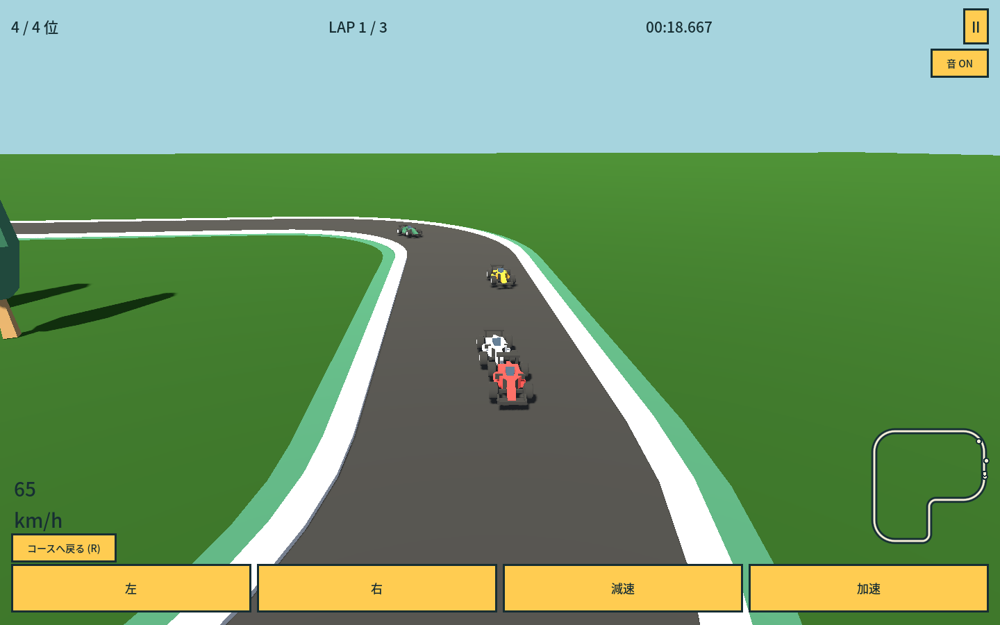

# ちび車グランプリ

カーブの前で減速、出口で加速。小さな車でCPU3台と競う3Dレースゲーム。
Godot 4.7.2 / Compatibility / GDScript。1コース約348m、3周制。ひとりで走るタイムアタックと、4色の車を選べます。



## 起動

```sh
npm run setup
npm run dev      # Godotエディタ。アクセシビリティを有効にして起動
npm run play     # ネイティブ版
npm run build
npm run preview  # http://127.0.0.1:4209/
```

macOSは公式Godot 4.7.2アプリを使用。`GODOT_BIN`で実行ファイルを指定可能。Linuxのsetupは公式実行ファイルとWebテンプレートを取得します。新しいnpm依存関係はありません。

## 遊び方

- W / ↑：加速。離すと惰性で減速。
- A・D / ←・→：ハンドル。
- S / ↓ / Space：ブレーキ。
- R /「コースへ戻る」：最後に正しく走行した位置へ復帰。
- Esc / II：一時停止・再開。別アプリへ移ると自動停止。
- M / 音ボタン：音のON/OFF。
- 画面下のボタンでも運転可能。タッチは加速と旋回の同時押しに対応。

芝生に出ると減速します。近くの別区間へ飛び越えても周回は加算されません。「R / コースへ戻る」で復帰してください。結果画面からすぐ再挑戦できます。最速ラップと車の色は端末内へ保存します。初回は記録を「--:--.---」と表示し、保存失敗は結果画面で知らせます。

## Godotで編集する

`game/project.godot`を開いてください。

- **`game/course.tscn`**：道路16部品を配置したコース。Computer UseでGodotのGUIを操作し、新規シーン作成、部品追加、位置・回転・縮尺の調整、保存まで行っています。
- **`game/scenes/race.tscn`**：Course、車4台、カメラ、照明、地面、スタートゲート、HUDを持つメインシーン。Courseの組み込みと、ピット1組・樹木5組の配置もGUIで行いました。
- **`game/scenes/Straight.tscn`、`RightWide.tscn`、`RightTight.tscn`、`LeftTight.tscn`**：道路の再利用部品。カーブのメッシュ原点・向きもGUIで補正しました。
- **`game/scenes/Car.tscn`**：車両のモデル・当たり判定と走行パラメータ。
- **`game/scenes/HUD.tscn`**：実際のControlノードで構成した画面。

部品定義とHUDの初期ファイルはテキストで用意し、コースと景観の配置をエディタで構成しています。道路や景観を実行時に生成するスクリプトはありません。新しい道路はシーンのインスタンスとして追加し、InspectorのTransformで移動・回転してください。部品の中心線はローカル座標なので配置と一緒に動きます。CPU経路は保存済み部品の接続から読み取ります。接続が切れている場合は開始画面でエラーを表示します。

道路の子メッシュだけを移動すると中心線とずれるため、通常は部品のルートを動かしてください。StartLineは基準部品から12mの位置です。スタート付近を移動・変更する場合は車のグリッドとゲート、`race.gd` / `car.gd`の開始距離も揃えてください。長い直線の一部はZ縮尺0.5です。

## 検証

```sh
npm run check
# headless import / 型チェック → 3周シミュレーションと入力・周回ルール → UI境界 → Web export
```

描画ありの確認（macOS / Linuxのディスプレイが必要）:

```sh
/Applications/Godot.app/Contents/MacOS/Godot --path game --script res://tests/ui.gd
/Applications/Godot.app/Contents/MacOS/Godot --path game --fixed-fps 60 --script res://tests/drive.gd
```

`qa/`に画像を出力します（Git管理外）。`tests/ui.gd`の結果画面はレイアウト確認用の状態。`tests/drive.gd`は同じ車両モデルで実際に3周走る自動運転で、完走画像を残します。テスト保存先は通常プレイと分離しています。

検証内容と限界は[VERIFICATION.md](VERIFICATION.md)、素材とライセンスは[ASSETS.md](ASSETS.md)。

## 初版の範囲

1コース、CPU3台、3周レース、タイムアタック、ローカル記録まで。オンライン対戦・車の改造・アイテム攻撃は含みません。CPUは固定の走行ペースで、難易度の長期的な評価と実機iPhoneのタッチ検証は今後の対象です。
