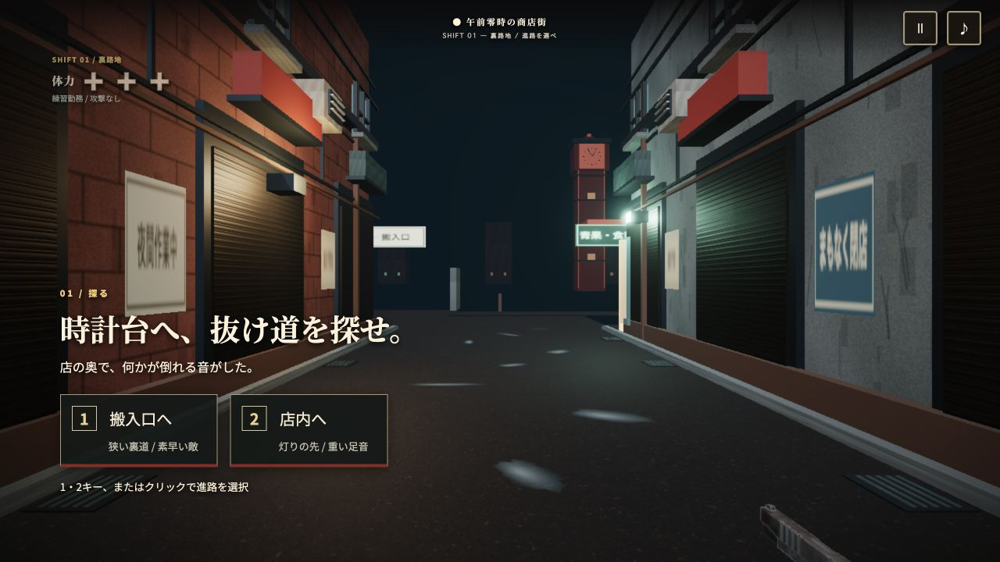

# 夜勤タイピング

深夜の商店街で、迫るゾンビをローマ字で撃退する一人称3Dタイピングシューター。
一文字ごとに発砲し、単語完成で撃破。連続ノーミス撃破に応じて光と音楽が5段階で盛り上がります。

**状態：Alpha 0.10。裏路地で進路を選び、店内または搬入口の接近戦、広場のショットガン一掃、屋上の夜明けへ進む短い一勤務。**

[GitHub Pagesで遊ぶ](https://hayatok.github.io/100challenge/2026-09-28/)（PC・キーボード専用）。公開ワークフローと公開後の確認結果は [Issue #130](https://github.com/hayatok/100challenge/issues/130) に記録。



## 実行

Node.js 24を使用します。

```sh
npm ci
npm run dev
npm run check
```

`npm run check` はコアの自動テスト、oxlint、TypeScript型チェック、Vite production buildを実行します。`npm run preview` でproduction buildを確認できます。

PCの物理キーボードが対象です。「勤務開始」を押し、日本語入力をオフにして `go` を入力してください。敵の頭上に表示される先頭キーで狙いが固定され、表示文を打ち切ると撃破します。誤打で入力進捗は戻りません。Escapeまたは画面右上で一時停止できます。

「設定」から難易度3段階、練習勤務、低モーション、BGM・効果音の音量を設定できます。練習勤務では敵が攻撃しません。設定、直近10回の結果、難易度・練習モード別の自己ベストをこのブラウザに保存し、入力したキーは保存しません。

## 構成

- TypeScript + Three.js：立体の街、スキン付きゾンビ、一人称の銃・腕、パーティクルと発光。
- HTML/CSS：揺れない入力欄、HUD、設定、結果。
- Web Audio：実録銃声3種と打撃・破片音、165 BPMのループ音楽。コンボで音の層とフィルタを変化。
- `src/typing.ts` / `src/game.ts` / `src/content.ts`：描画と独立した入力・進行・出題。
- `src/scene.ts` / `src/district.ts` / `src/rail.ts` / `src/weapon.ts`：3D画面。

開始時の1・2キーまたはクリックで店内／搬入口を選びます。短い路地戦から、ルート別の敵構成、任意のラッキー遭遇、広場の一語3体×4群のFEVER、3段階のボス、屋上の休息へ進行します。屋上からEnterまたは「勤務を終える」で結果へ。区間リトライと同じ出題での再挑戦に対応します。

章専用の短文は疾走者5〜10、会社員8〜16、巨体12〜22ローマ字程度。既存303件の通常出題はデータと従来コアに保持し、新しい一勤務では場面専用の出題を使います。人物は既存2種類の原型を継続使用。

## 品質と検証

[実施結果・未確認事項](docs/RESULTS.md)を参照してください。コードの成功、ブラウザ操作の成功、見た目・音の完成度は分けて記録しています。

承認された[生成参考画像](art/reference/gameplay-approved-v1.png)は構図・質感の目標であり、ゲーム背景として使用していません。現在の敵の画風の統一、握り姿勢、路面の反射は参考画像と差があり、アートの完成判定は保留です。

素材の出典・加工は [THIRD_PARTY_NOTICES.md](THIRD_PARTY_NOTICES.md)、[人物素材](docs/CHARACTER_ASSETS.md)、[環境素材](docs/ENVIRONMENT_ASSETS.md) に記録しています。既存作品のキャラクター、音声、ロゴは含めていません。

仕様：[GAME_SPEC.md](docs/GAME_SPEC.md) / [ART_AUDIO.md](docs/ART_AUDIO.md) / [TECH_DECISION.md](docs/TECH_DECISION.md) / [VALIDATION.md](docs/VALIDATION.md)

課題：[実装 #130](https://github.com/hayatok/100challenge/issues/130)、[設計 #129](https://github.com/hayatok/100challenge/issues/129)。

変更内容：[v0.3計画](docs/V03_PLAN.md) / [戦闘・記録](docs/V03_LOGIC.md) / [キャラクター](docs/V03_CHARACTERS.md) / [音](docs/V03_AUDIO.md)。検証と未確認事項：[RESULTS.md](docs/RESULTS.md)。


v0.4：[計画](docs/V04_PLAN.md) / [街](docs/V04_ENVIRONMENT.md) / [人物](docs/V04_CHARACTERS.md) / [銃と音](docs/V04_WEAPON_AUDIO.md) / [演出](docs/V04_SCENE.md)。

v0.5：[計画](docs/V05_PLAN.md) / [戦闘](docs/V05_LOGIC.md) / [音](docs/V05_AUDIO.md) / [結果と次回目標](docs/V05_RESULTS.md)。

v0.5時点では通常撃破でFEVERをためていました。v0.10の章では広場で専用ショットガン4連戦へ移行します。赤いタンクの敵を倒すと、点線枠の敵も巻き込みます。巻き込みは1体75点の別ボーナスで、コンボを増やしません。結果画面から同じ出題順で再挑戦でき、以前の版のスコアとは比較しません。


v0.6：[計画](docs/V06_PLAN.md) / [遭遇・報酬](docs/V06_LOGIC.md) / [人物モーション](docs/V06_MOTION.md) / [音](docs/V06_AUDIO.md)。

紫と金色のラッキーゾンビは1勤務に最大1回、通常は約半分の勤務で登場。練習勤務では必ず登場します。3つの短文を打ち切ると500点と体力1回復（上限3）。誤打・見逃しでコンボや体力は失わず、通常の正確率・入力速度にも混ぜません。練習でもボーナスタイムには制限時間があります。


v0.7：[計画](docs/V07_PLAN.md) / [入口と環境反応](docs/V07_ENVIRONMENT.md) / [人物](docs/V07_CHARACTER.md) / [追加素材](docs/V07_MATERIALS.md)。

入口の通常撃破から跳弾が商品台に届き、缶が床へ飛び散ります（左右各1回）。得点と期限は従来どおり。ゾンビと銃は既存モデルの材質・見え方を改善したもので、新規モデルへの差し替えではありません。


v0.8：[計画](docs/V08_PLAN.md) / [音](docs/V08_AUDIO.md) / [戦闘エフェクト](docs/V08_EFFECTS.md)。

コンボで街の光が増え、15コンボからOVERDRIVE。FEVERは4体を倒すたびに音が高くなり、完走時は花火と金色の完走表示。ラッキー成功はJACKPOT、爆発連鎖は実際の撃破数を表示します。入力と制限時間は演出から独立し、低モーションで光・飛散を抑えられます。得点規則や報酬はv0.7と同じです。


v0.9：[UI計画](docs/V09_PLAN.md) / [承認コンセプト](art/reference/ui-approved-v09.png)。

赤黒の筐体プレート、中央ロゴと勤務開始、勤務精算票の評価印、限界残業/全員退勤/大当りの専用文字演出。設定・入力確認・休止も同じ外観に統一。入力の現在文字を下線で示し、設定のキーボードフォーカスとEscape時の保存を改善。採点・保存ルール・3Dモデル・音はv0.8を維持。生成画像の背景やゾンビの品質は、実装済みの品質とは区別します。


v0.10：[進路と戦闘の再構成](docs/V10_JOURNEY.md)。
