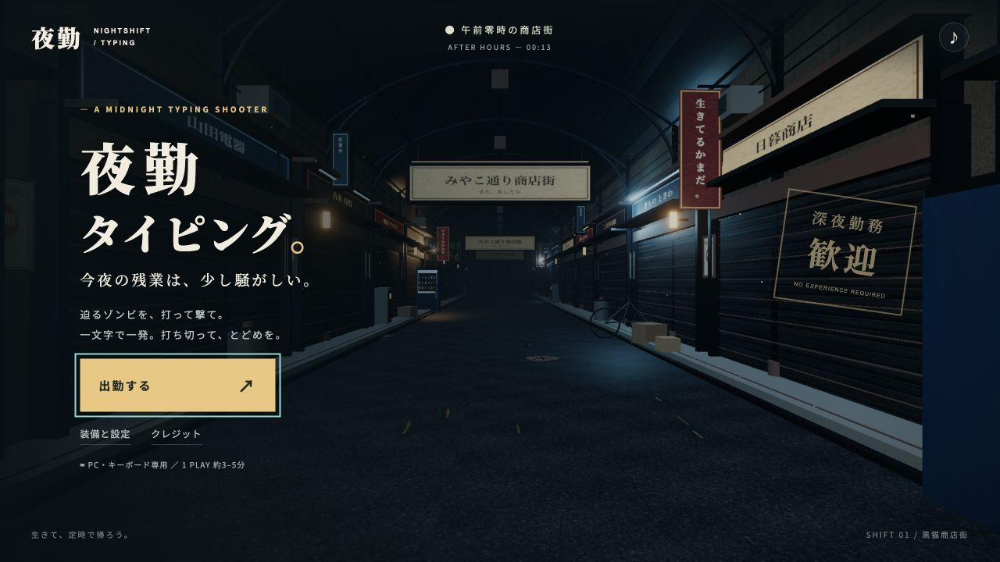

# 夜勤タイピング

深夜の商店街で、迫るゾンビをローマ字で撃退する一人称3Dタイピングシューター。
一文字ごとに発砲し、単語完成で撃破。連続ノーミス撃破に応じて光と音楽が5段階で盛り上がります。

**状態：プレイ可能な初版。承認画像の質感を目標に調整中。公開は未実施。**



## 実行

Node.js 24を使用します。

```sh
npm ci
npm run dev
npm run check
```

`npm run check` はコアの自動テスト、oxlint、TypeScript型チェック、Vite production buildを実行します。`npm run preview` でproduction buildを確認できます。

PCの物理キーボードが対象です。「出勤する」を押し、日本語入力をオフにして `go` を入力してください。敵の頭上に表示される先頭キーで狙いが固定され、表示文を打ち切ると撃破します。誤打で入力進捗は戻りません。Escapeまたは画面右上で一時停止できます。

「装備と設定」から難易度3段階、練習勤務、低モーション、BGM・効果音の音量を設定できます。練習勤務では敵が攻撃しません。設定と直近10回の結果だけをこのブラウザに保存し、入力したキーは保存しません。

## 構成

- TypeScript + Three.js：立体の街、スキン付きゾンビ、一人称の銃・腕、パーティクルと発光。
- HTML/CSS：揺れない入力欄、HUD、設定、結果。
- Web Audio：自作の合成銃声・撃破音と、コンボで重なる音楽。
- `src/typing.ts` / `src/game.ts` / `src/content.ts`：描画と独立した入力・進行・出題。
- `src/scene.ts` / `src/environment.ts` / `src/weapon.ts`：3D画面。

24体の通常敵と3段階のボス、90件の通常出題、体力、区間リトライを実装しています。通常敵3種は進行上の役割と体格で区別していますが、現在のベースモデルは共通です。

## 品質と検証

[実施結果・未確認事項](docs/RESULTS.md)を参照してください。コードの成功、ブラウザ操作の成功、見た目・音の完成度は分けて記録しています。

承認された[生成参考画像](art/reference/gameplay-approved-v1.png)は構図・質感の目標であり、ゲーム背景として使用していません。現在の敵の顔や衣装、握り姿勢、路面の反射は参考画像と差があり、アートの完成判定は保留です。

素材の出典・加工は [THIRD_PARTY_NOTICES.md](THIRD_PARTY_NOTICES.md)、[人物素材](docs/CHARACTER_ASSETS.md)、[環境素材](docs/ENVIRONMENT_ASSETS.md) に記録しています。既存作品のキャラクター、音声、ロゴは含めていません。

仕様：[GAME_SPEC.md](docs/GAME_SPEC.md) / [ART_AUDIO.md](docs/ART_AUDIO.md) / [TECH_DECISION.md](docs/TECH_DECISION.md) / [VALIDATION.md](docs/VALIDATION.md)

課題：[実装 #130](https://github.com/hayatok/100challenge/issues/130)、[設計 #129](https://github.com/hayatok/100challenge/issues/129)。
