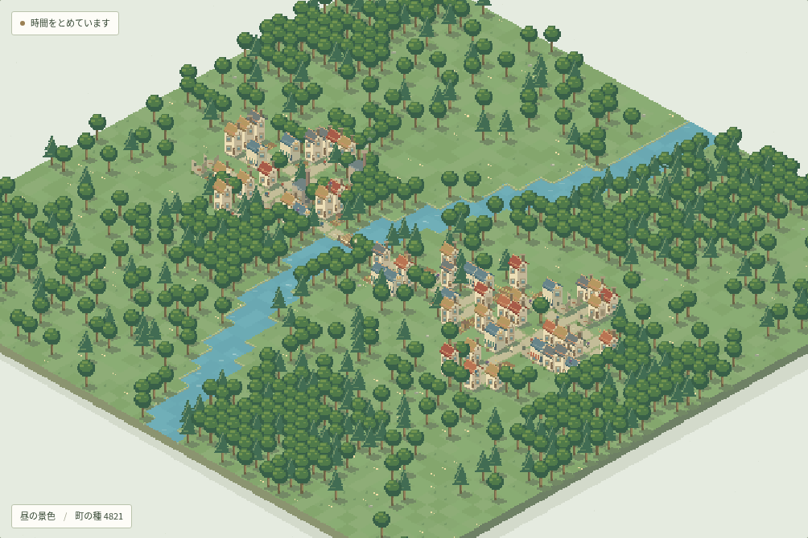

# まちの呼吸 v0.2

恵みも災いも与えられる、小さな世界の神様。住民が働き、食を運び、暮らしを育てる町へ雨や雷、地震、隕石を与え、その後の発展・荒廃・復興を眺めるドット絵の箱庭です。力に回数・資源・クールダウンの制限はありません。

[GitHub Pagesで遊ぶ](https://hayatok.github.io/100challenge/2026-09-30/)。v0.2の開発・確認記録は [V02_RESULTS.md](./docs/V02_RESULTS.md) に記録します。



## 起動

Node.js 24を推奨。

```bash
cd 2026-09-30
npm ci
npm run dev
```

通常のURLは `http://localhost:5173/`。実行時に外部API、LLM、ログインは必要ありません。

```bash
npm run check   # シミュレーション・災害・保存・描画、lint、型、production build
npm run preview # dist/の確認
```

## 神様として遊ぶ

1. 雨・日差し・芽吹き・入植・嵐・雷・地震・隕石から力を選ぶ。
2. 地図を選び、範囲・強さ・時間と、直接の範囲に入る家・畑・橋を確認する。
3. 「ここへ使う」で予約。停止中は「一歩進める」か時間の再開で適用する。同じ地点へ重ねて使える。
4. 未適用の予約は取消できる。「前の介入の前へ戻る」は直前にまとめて適用した一組の前へ町全体を巻き戻す。その後の未来も戻り、命令は再適用しない。
5. 観察へ戻る、またはEscapeで力の選択を解除。ドラッグは地図の移動で、力の発動には別の実行操作が必要。

恵みの雨は土を潤し、火を消します。雨が多すぎれば低い土地が浸水します。濡れた畑でも働き手が来なければ収穫は増えず、橋が壊れた地区には道を使う配送が届きません。日差しは地面を乾かし、芽吹きは土と緑を回復します。人や家が無条件で戻る力ではありません。

雷は着火、地震は屋根や橋の損傷、隕石はクレーターと火災を残します。隕石の「終末」は明示的に選ぶ町全体の破壊です。全人口を失っても自然と操作は続きます。復元するか、安全な土地へ食・資材・道具を持った入植者を迎え、新しい暮らしを始められます。

自然の設定は「なし」「穏やか」「荒れる世界」「終末も起こる世界」。なしでも日常の天候は移り変わります。終末規模の自然災害は、その設定を選んだ場合に起こります。神様の力はどの設定でも使えます。

## 暮らしを観察する

- 一日は通常45秒、12日で一季節、48日で一年。暦・移動・災害は0.25秒の固定ステップ時計を共有。一時停止・1×・4×・12×で調整できます。
- 人物一人が人口一人。働く人と扶養される人を持ち、人口は出生・流入・転出・死亡で変わります。家が大きくなるだけでは人は発生しません。
- 畑は現場の労働、水分、土、気温で食を作り、工場は修繕資材を作ります。在庫は区画ごとに保持し、道を使う配送には移動時間がかかります。在庫のない店では購入できません。
- 食不足が続くと空腹、健康、働く力、定住へ響きます。被災した住民は避難や待機をし、修繕と建設には資材と労働を使います。
- 建物・土地を選ぶと、理由、在庫、損傷、浸水を表示。「住民の一日を追う」は同じ住民IDの行動と健康を追います。浸水・火災・食の蓄えの補助表示も選べます。
- ＋/−で拡大縮小、ドラッグで移動、「全体を見る」でカメラを戻す。矢印キーで地点選択、Spaceで停止、Escapeで解除。
- 「別の町を眺める」と「前の町に戻る」で直前の世界へ戻れます。「写真を撮る」はPNGを保存します。

水は標高に応じて隣接マスへ流れる簡易格子モデル。年齢・賃金・価格・人間関係を細かく再現する都市モデルではありません。配送も区画間の荷物単位で、個別の運転手の生活は扱いません。実際の都市・河川・災害の予測用途ではありません。

## 保存と引き継ぎ

V3保存は固定時計、住民の旅・健康・避難先、区画在庫、輸送中の荷物、天候と災害、予約、乱数状態を保持します。ブラウザのlocalStorageへ自動保存し、バックグラウンドでは時間を止めます。低モーションでは停止から始まり、閃光や揺れを抑えます。

V1/V2の町は地形・建物・既存人口を引き継ぎます。旧版で描かれなかった住民を補い、食の備蓄と移行猶予を設定します。旧時計は新しい時計へ換算し、旧暦の履歴も保持します。移行前の元データは別の保存キーへ退避。退避できない場合は元の記録を保護し、現在の画面の町の自動保存を止めて通知します。

直前の介入前の復元点も保存します。保存領域が足りない場合は画面上に通知し、画面内に保持する復元点は再読み込みすると失われる場合があります。ブラウザのデータを消すと町と復元点も消えます。

## 構成と記録

- `src/simulation.ts`: 世界生成、共通時計、労働・資源・建設・人口、保存移行と検証。
- `src/mobility.ts`: 通行性、職場の定員、連続移動、避難・修繕への道。
- `src/disasters.ts`: 神の命令、天候、浸水、火災、損傷と自然の再生。
- `src/renderer.ts`: 自作ドット絵、昼夜・季節、被害と活動、範囲プレビュー。
- `src/main.ts` / `style.css`: 操作、観察、保存と復元。
- [v0.2計画](./docs/V02_PLAN.md)、[設計草案](./docs/GOD_SANDBOX_DESIGN.md)、[v0.2確認記録](./docs/V02_RESULTS.md)、[Issue #149](https://github.com/hayatok/100challenge/issues/149)。
- 過去: [初版計画](./docs/PLAN.md)、[初版結果](./docs/RESULTS.md)、[改善計画](./docs/IMPROVEMENT_PLAN.md)、[改善結果](./docs/IMPROVEMENT_RESULTS.md)、[v0.1公開確認](./docs/RELEASE_2026-10-01.md)。

素材はCanvasで制作したオリジナル。新しい実行時ライブラリ、外部画像・音声は使用していません。上の画像と既存screenshotsは過去の版です。v0.2の実画面確認範囲と未確認事項は確認記録を参照してください。
